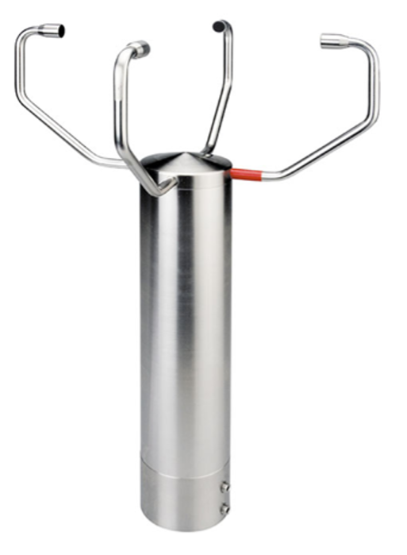
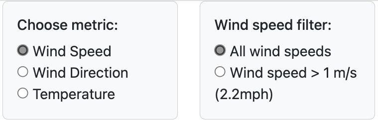

# Project3
- Anemometer Data Comparison Dashboard
- Steph Abegg

## Research Question

3D anemometers offer more comprehensive measurements than 2D anemometers by capturing wind speed and direction in three dimensions, providing a complete understanding of wind flow. This makes them ideal for complex environments and scientific research that require detailed wind analysis. However, they are typically more expensive and may be more susceptible to environmental factors such as precipitation and icing up. In contrast, 2D anemometers measure only the horizontal components of wind speed and direction, making them suitable for applications where vertical wind measurements are less critical or where there is a fair amount of precipitation.

A question is whether 2D anemometer data such as temperature, wind direction, and wind speed can be used as a substitute for the equivalent measurements from a 3D anemometer. This would be particularly beneficial during the times when a 3D anemometer is iced up. To address this question, we analyze data collected from a 2D anemometer and a 3D anemometer at the same location during the same 30-day time frame. The data from both anemometers is recorded on 5-second intervals. The data for each anemometer is first averaged over 15-minute windows (this smooths out the data as well as corresponds to how the wind data is used in practice), and then the 15-minute averaged temperatures, wind directions, and wind speeds are directly compared via timeseries plots, regression analysis, and binning.

 

## The Data

This study uses two datasets, both from anemometers located in North Dakota at 47.8437 N, 102.8524 W, elevation 2300 ft above sea level. The data from both anemometers spans spans 30 days from February 11, 2024 to March 11, 2024. One dataset is from is from a 2D anemometer and the other from a 3D anemometer. The anemometers measure on five-second intervals. There are two two-day gaps in the data, corresponding to when one or both of the anemometers was iced up: February 22 and 23 (both anemometers iced up) and March 3 and 4 (3D anemometer iced up). So we have a total of 26 days of data to compare. The raw 2D anemometer data contains 472,048 rows (pared down to 404,984 rows after cleaning the data) and the raw 3D anemometer data contains 420,917 rows (pared down to 420,911 rows after cleaning the data).

The relevant columns include:

- Date and time in UTC;

- Number of internal data points used to compute the measurements corresponding to a single time;

- Temperature in degrees Celsius;

- Wind direction in degrees (North: 0°, East: 90°);

- Wind speed in meters per second.

- Wind elevation in degrees (3D anemometer only).

In practice the anemometer data is averaged only 15-minute intervals. After doing so (described in the dar preparation section below), there were 2626 rows of data.

## Data Preparation

Before analysis could ensue, the datasets had to be cleaned and columns had to be added. My data preparation was done with Python in the file [datacleaning.ipynb](datacleaning.ipynb). 

### Cleaning:

The various cleaning steps are described below.

- The UTC time column was changed into a datetime64 format.

- The seconds column was added to the UTC time, which curiously had all of the seconds zeroed out in the original dataset.

 - Columns that were not needed for the analysis were removed. Examples of columns that were removed were “_id”, “Origin of data”, and various pre-calculated date, hour, minute, second, and second bins that were later added back in forms more useful to this analysis.

 - Columns were renamed to clarify units (e.g. “temp” to “temp_C”, “wspd” to “wspd_mps”).

 - Rows with null values were dropped.

 - Histograms of the column data were created to check if the data had any obvious outliers or points in error. This revealed that the 2D anemometer data had a few data points with unrealistic temperatures (e.g. as low as -97°C and as high as 93°C, a bit extreme for even North Dakota in the winter!). Any rows where the temperature was outside of -30°C to 30°C were removed. Neither the 3D anemometer data nor the NAM data had temperatures outside of this range.

- The measurements from the anemometers are in five-second intervals. An individual measurement is an internal computation from several data points taken over the preceding five seconds. This number is given in the “n_pts” column.  A typical measurement from the 3D anemometer is computed from about 100 individual data points while a typical measurement from the 2D anemometer is computed from about 25 individual data points. The histograms indicated that some measurements had just a couple of data points contributing to the measurement. Any rows where the number of internal data points was less than five were removed.  

- The data was checked for duplicate rows. There were no duplicate rows. 

- To make the wind speeds from the 3D anemometer comparable with the wind speeds from the 2D anemometer, the wind speed from the 3D anemometer was adjusted to just the horizontal component multiplying by the cosine of the wind elevation. The wind elevation angles are generally small, so this correction had very little effect on the wind speeds.

- The two anemometers corresponded to different heights above the ground. The 3D anemometer is 3 meters above the ground, the 2D anemometer is 5.2 meters above the ground. To be comparable, the wind speeds were corrected using the wind shear formula (v_2=v_1  ((h_2/z_0 )  )/((h_1/z_0 ) ), where v_1 is the reference wind speed measured at height h_1, v_2 is the wind speed at height h_2, and z_0 is the roughness length which depends on the terrain).  The height of the 3D anemometer was used for reference, and the 2D anemometer wind speeds were corrected to represent a height of 3 meters above the ground.

### New Columns:

The columns that were added are described below. 

- To make the time series plots more representative of a local day (midnight to midnight), a column for local time was added. The location of the anemometers is in Central Time, which is UTC -06:00, so computing local time involved subtracting 6 hours from the UTC time.

- Columns were added for date and hour of day, both in local time.

- A column was added for minute. This was used for binning into 15-minute intervals.

- A column was added to bin the 2D and 3D anemometer data into 15-minute intervals, starting on the hour. This was used for averaging the temperature, wind speed, and wind direction over every 15 minutes. This smooths out the data as well as corresponds to how the wind data is used in practice.

- Columns were added for the cosines and sines of the wind direction. This was needed for the circular averaging of the wind direction over the 15-minute bins. Circular averaging averages the east-west and north-south components separately, and then computes the average wind angle by finding the arctangent of the ratio of the components. Also, the cosine and sine components of the wind direction were needed for the multilinear regression models. Standard linear regression cannot handle the circular nature of time properly because it assumes a linear relationship and does not account for the circular wrap-around of angles.

- A column was added for temperature in degrees Fahrenheit. Fahrenheit is the unit used for the plots, being more commonplace in the United States than Celsius.

- A column was added for wind speed in miles per hour. Miles per hour is the unit used for the plots, being more commonplace in the United States than meters per second.

### Joined Dataframes: 

Now that the data was cleaned and the necessary columns added, it was time to merge the two datasets to allow for direct comparison of the data for the same times. New dataframes (designated “data_2D_15min” and “data_3D_15min”) were created for each of the 2D and 3D anemometer data sets, by averaging temperature, wind direction, and wind speed over 15-minute intervals. The wind direction was averaged using circular averaging. Circular averaging averages the east-west and north-south components separately, and then computes the average wind angle by finding the arctangent of the ratio of the components. Finally, a dataframe “df_2D_and_3D” was created via an outer join of the 15-minute averaged 2D anemometer data with the 15-minute averaged 3D anemometer data, joining on date, hour, and 15-minute bin. For all but the four days where one or both of the anemometers were iced up, this gives a 1 to 1 comparison of measurements.

## The Elements of the Dashboard

The elements of the dashboard are:

(1) A dropdown list with three options: Wind Speed, Wind Direction, Temperature. This allows different data to be to be selected. All of the plots and metadata update when a new option is selected.

(2) A timeseries that shows the 2D and 3D anemometer data over time, as well as the difference between the measurements correpsonding to the same 15-minute window.

(3) A histogram for the differences between the measuements.

(4) A scatterplot of 2D vs. 3D data. A regression line and R^2 value is plotted.

I deployed my repository to GitHub Pages. The interactive dashboard I created in this assignment can be displayed and interacted with at the following link. However, since the data is accessed from a local database on a local server, my local server must be running for the data to display.

https://sabegg2.github.io/Project3/

The javascript and html files for the dashboard are [app.js](static/js/app.js) and [index.html](index.html).

## Database

In this project, we were required to store and extract the data from at least one database. I used pgAdmin. My SQL schema is [anemometer_db_schema.sql](anemometer_db_schema.sql). To access the data, I wrote a Node.js server ([server.js](static/js/app.js) that will query your PostgreSQL database and serve the data over HTTP as a json file. In order for the data to display, my local server needs to be running.

## New Library Not Covered in Class

In this project, we were required to include at least one JavaScript OR Python library that we did not cover. I used three new libraries: pg, express, and cors. The pg library is used to interact with PostgreSQL databases from a Node.js application. The express library is a fast, minimalist web framework for Node.js, used to build web servers and APIs. The cors library provides middleware to enable Cross-Origin Resource Sharing (CORS) in an Express application. CORS allows your server to handle requests from different origins (domains, ports). 

## Ethical Considerations

## Data Analysis

### Timeseries comparison

Figure 7 shows timeseries of the 15-minute averaged temperature, wind direction, and wind speed measurements of both the 2D (gold) and 3D (blue) anemometers over the 30-day span of data. Visually, the 2D and 3D anemometer data for all dependent variables line up well. The green dots show the difference (2D-3D) between the 15-minute averages. These differences hover near zero and are within the tolerances of the measurements (e.g. the tolerance of a wind direction measurement is 20 degrees, and the wind direction difference between the 2D and 3D anemometer measurements falls well below this value; a similar argument can be made for the difference in temperatures and wind speeds).  

### Histogram analysis

Over the 30-day span of data, the average temperature difference (2D-3D) between the 2D and 3D anemometers was about 0.9°F, where the 2D anemometer recorded slightly higher temperatures on average.  
Over the 30-day span of data, the average wind direction difference (2D-3D) between the 2D and 3D anemometers was -2.5 degrees, well within the 20 degree (or so) tolerance of a wind direction measurement from an anemometer. 
Over the 30-day span of data, the average wind speed difference (2D-3D) between the 2D and 3D anemometers was only -0.3 miles per hour. 

### Regression analysis

The 2D and 3D anemometers are from the same location, so under ideal behavior they would record the same measurements, barring for small differences due to height and terrain. Linear regressions were conducted to quantify the linear relationship between the measurements of the two anemometers. The data is colored on a gradient corresponding to wind speed, the metric that has greatest effect on scatter.

Figure 9 shows the linear regression between the 15-minute averaged temperature measurements of the two anemometers. Each data point corresponds to the same 15 minutes in time. We see that the data follows a linear relationship with slope close to 1 with a correlation coefficient of 0.99, which indicates a strong positive linear relationship. The points further from the line tend to have lower wind speeds.

Figure 10 shows the linear regression between the 15-minute averaged wind direction measurements of the two anemometers. Each data point corresponds to the same 15 minutes in time. We see that the data follows a linear relationship with slope close to 1 with a correlation coefficient of 0.99, which indicates a strong positive linear relationship. The points further from the line tend to have lower wind speeds. This makes sense, as calm winds have a less definite wind direction.

Figure 11 shows the linear regression between the 15-minute averaged wind speed measurements of the two anemometers. Each data point corresponds to the same 15 minutes in time. We see that the data follows a linear relationship with slope close to 1 with a correlation coefficient of 0.95, which indicates a strong positive linear relationship. The scatter tends to increase as wind speed increases.

### Overall conclusion

Based on this analysis, the measurements of temperature, wind direction, and wind speed from the 2D and 3D anemometer show themselves to be very similar and with a strong linear relationship. There is some scatter in the data, but when averaged over time, the values are within a reasonable error tolerance. Removing data with low wind speeds (less than 1m/s, the typical threshold for reliable measurements anyway) reduces the scatter. This suggests that the 2D anemometer data can be used instead of the 3D anemometer data if needed.

## References for Data

The wind data was provided by LongPath Tecchnologies, Inc., a methane-gas monitoring service based in Boulder, Colorado. The data was collected at one of the sites they monitor. [https://www.longpathtech.com/](https://www.longpathtech.com/).

## References for Code

For the most part, I wrote my code on my own, using techniques learned in class. I find ChatGTP to be a great helper for directing me on the correct path. The only significant code that I pulled directly from ChatGTP is the server.js code for connecting with the pgAdmin database.
